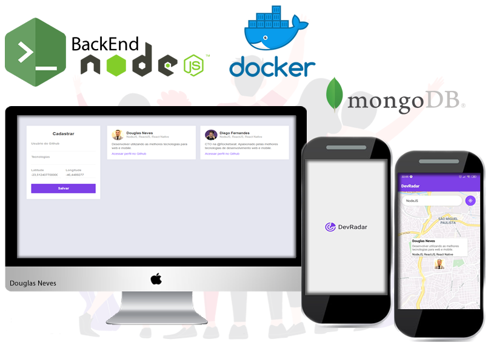

<h1 align="center">
    
</h1>

<h2 align="center">
  :rocket: Semana OmniStack 10.0
</h2>

<p align="center">
  <a href="#computer-projeto">Projeto</a>&nbsp;&nbsp;&nbsp;|&nbsp;&nbsp;&nbsp;
  <a href="#rocket-tecnologias">Tecnologias</a>&nbsp;&nbsp;&nbsp;|&nbsp;&nbsp;&nbsp;
  <a href="#information_source-como-usar-?">Como usar ?</a>
</p>

<p align="center">
  
</p>

## :computer: Projeto

<strong>DevRadar</strong> é um projeto da <strong>10º edição da Semana OmniStack.</strong>

O projeto é um sistema que permite cadastrar <i>devs</i> informando o login do github, tecnologias usada pelo desenvolvedor e sua localização por latitude e longitude. A partir daí os <i>usuarios</i> podem localizar os desenvolvedores por suas respectiva tecnologias e localização.

Na ideia original, a versão Web, feita em React, conta apenas com a parte administrativa para cadastrar os <i>DEVS</i>.

Já no aplicativo, desenvolvido em React Native, foi destinado para a busca dos devs. Estes visualizam um mapa local do google aonde atraves do filtro o usuario define as tecnologias que necessita e encontra desenvolvedores cadastrados.

## :rocket: Tecnologias

### Back-End (NodeJS)
- [Node.js](https://nodejs.org/en/)
- [Express](https://expressjs.com/pt-br/)
- [Nodemon](https://www.npmjs.com/package/nodemon)
- [MongoDB](https://www.npmjs.com/package/mongoose)
- [Cors](https://www.npmjs.com/package/cors)
- [Docker](https://www.docker.com/)

#### Comandos Back-End (NodeJS)
```bash
$ yarn init -y
$ yarn add express (framework)
$ yarn add nodemon -D
$ yarn nodemon index.js
$ yarn add mongoose (commuction mongodb)
$ yarn add cors
```
### DOCKER (MongoDB)
- docker ps images (view images)
- docker pull mongodb (downloads images)
- docker run --name mongodb -p 27017:27017 -d mongo (Create container)
- docker ps -a (View container in execute)
- Open MongoDB Compass
- docker exec -it mongodb mongo admin (Acess container mongodb in docker)

### Front-End (ReactJS)
- [React](https://reactjs.org)
- [React Icons](https://www.npmjs.com/package/react-icons)
- [Axios](https://www.npmjs.com/package/axios)
- [React-router-dom](https://www.npmjs.com/package/react-router-dom)

### Comandos Front-End (ReactJS)
```bash
$ npx create-react-app frontend  (start project)
$ yarn start  (start application)
$ cleaning project src(README.md, App.css, App.test.js, index.css, logo.svg, serviceWorker.js, setupTests.js)
$ cleaning project public(robots.txt, manigest.json, logo512.png, logo192.png)
$ yarn add react-icons (Icons)
$ yarn add react-router-dom (Routes)
$ yarn add axios (Connect backend - Client HTTP)
```

## Mobile (React Native)
- [React Native](https://facebook.github.io/react-native/)
- [Expo](https://expo.io/)
- [Axios](https://www.npmjs.com/package/axios)
- [@react-navigation/native](https://www.npmjs.com/package/@react-navigation/native)
- [react-native-maps](https://www.npmjs.com/package/react-native-maps)
- [expo-location](https://www.npmjs.com/package/expo-location)
- [react-native-webview](https://www.npmjs.com/package/react-native-webview)

### Comandos Front-End (React Native)
```bash
$ yarn add -g expo-cli  (install expo global)
$ expo init mobile (create project)
$ Install expo in android/IOS
$ yarn start (start application)
$ expo install react-native-maps (maps)
$ expo install expo-location (location user)
$ expo install react-native-webview (mail expo)
$ yarn add axios (Connect backend - Client HTTP)
$ yarn add @react-navigation/native
$ expo install react-native-gesture-handler react-native-reanimated react-native-screens react-native-safe-area-context @react-native-community/masked-view
$ yarn add @react-navigation/stack
```

## :information_source: Como usar ?

### Back-End NodeJS
- Instale as dependencias: npm install / yarn
- Execute a aplicação: npm start / yarn start
- Teste: npm test

### Front-End ReactJS
- Instale as dependencias: npm install / yarn
- Execute a aplicação: npm start / yarn start

### Mobile React Native
- Instale as dependencias: npm install / yarn
- Execute a aplicação: npm start / yarn start
