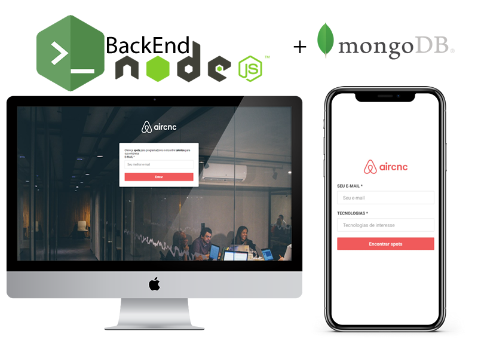

<h1 align="center">
    
</h1>

<h2 align="center">
  :rocket: Semana OmniStack 9.0
</h2>

<p align="center">
  <a href="#computer-projeto">Projeto</a>&nbsp;&nbsp;&nbsp;|&nbsp;&nbsp;&nbsp;
  <a href="#rocket-tecnologias">Tecnologias</a>&nbsp;&nbsp;&nbsp;|&nbsp;&nbsp;&nbsp;
  <a href="#information_source-como-usar-?">Como usar ?</a>
</p>

<p align="center">
  
</p>

## :computer: Projeto

<strong>AIRCNC</strong> é um projeto da <strong>9º edição da Semana OmniStack.</strong>

É um projeto que visa conectar empresas que querem abrir spots e desenvolvedores que procuram um lugar para trocar falar com devs, conhecer a empresa e trabalhar lá por um período.

## :rocket: Tecnologias

### Back-End (NodeJS)
- [Node.js](https://nodejs.org/en/)
- [Express](https://expressjs.com/pt-br/)
- [Nodemon](https://www.npmjs.com/package/nodemon)
- [Mongoose](https://mongoosejs.com/)
- [Multer](https://www.npmjs.com/package/multer)
- [socket.io](https://socket.io/)


#### Comandos Back-End (NodeJS)
```bash
$ yarn init -y (start project)
$ yarn add express (framework)
$ node index.js (start application)
$ yarn add nodemon -D (Reload application)
$ yarn add mongoose (Database)
$ yarn add multer (Image)
$ yarn add socket.io (NetWork)
```

### Front-End (ReactJS)
- [React](https://reactjs.org)
- [Axios](https://www.npmjs.com/package/axios)
- [React-router-dom](https://www.npmjs.com/package/react-router-dom)
- [socket.io-client](https://socket.io/docs/v3/client-api/index.html)

### Comandos Front-End (ReactJS)
```bash
$ npx create-react-app site  (start project)
$ yarn start  (start application)
$ cleaning project src(README.md, App.css, App.test.js, index.css, logo.svg, serviceWorker.js, setupTests.js)
$ cleaning project public(robots.txt, manigest.json, logo512.png, logo192.png)
$ yarn add socket.io-client (NetWork)
$ yarn add react-router-dom (Routes)
$ yarn add axios (Connect backend - Client HTTP)
```

## Mobile (React Native)
- [React Native](https://facebook.github.io/react-native/)
- [Expo](https://expo.io/)
- [Axios](https://www.npmjs.com/package/axios)
- [socket.io-client](https://socket.io/docs/v3/client-api/index.html)

### Comandos Front-End (React Native)
```bash
$ yarn add -g expo-cli  (install expo global)
$ expo init mobile (create project)
$ Install expo in android/IOS
$ yarn start (start application)
$ yarn add axios (Connect backend - Client HTTP)
$ yarn add socket.io-client (NetWork)
```

## :information_source: Como usar ?

### Back-End NodeJS
- Instale as dependencias: npm install / yarn
- Execute a aplicação: npm start / yarn start
- Teste: npm test

### Front-End ReactJS
- Instale as dependencias: npm install / yarn
- Execute a aplicação: npm start / yarn start

### Mobile React Native
- Instale as dependencias: npm install / yarn
- Execute a aplicação: npm start / yarn start
